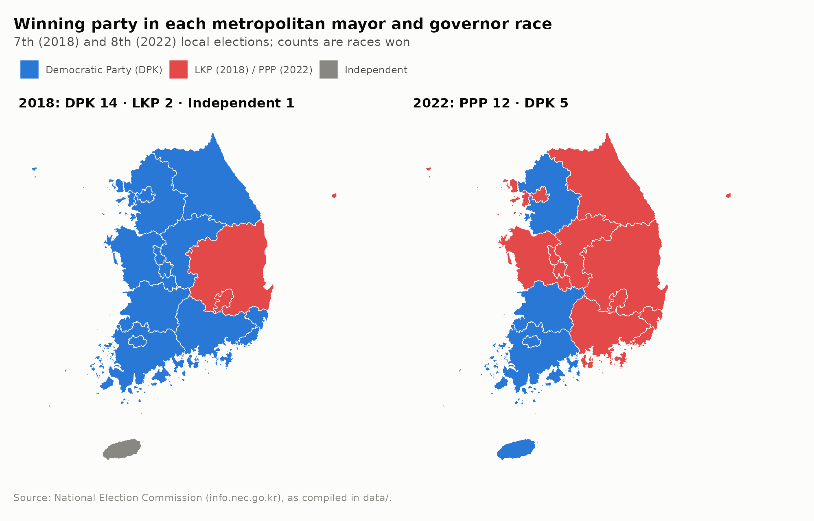
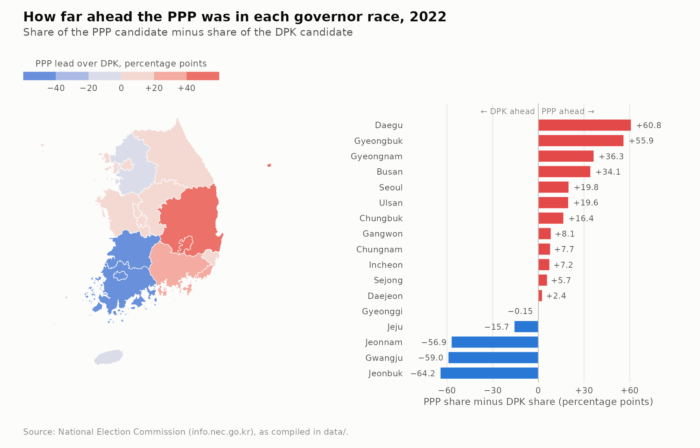
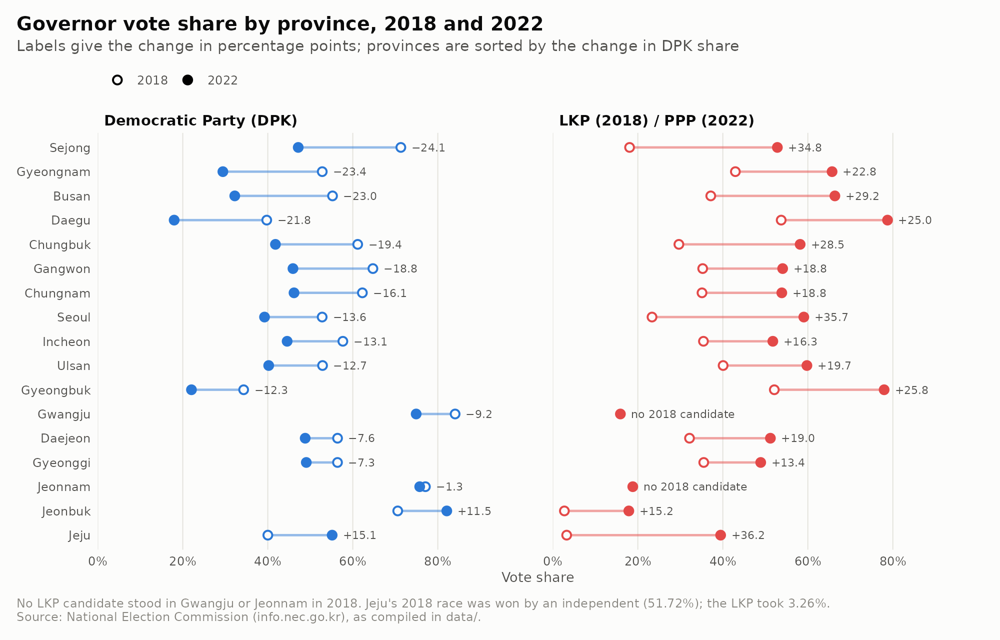
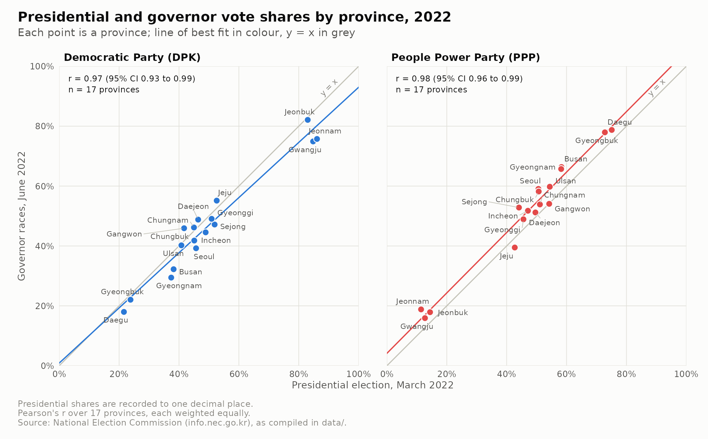
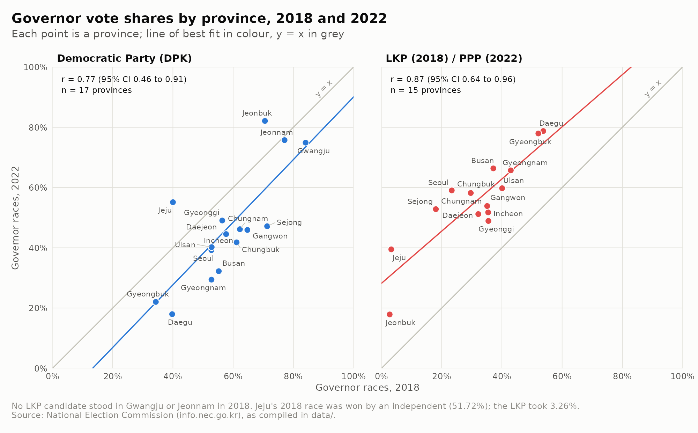
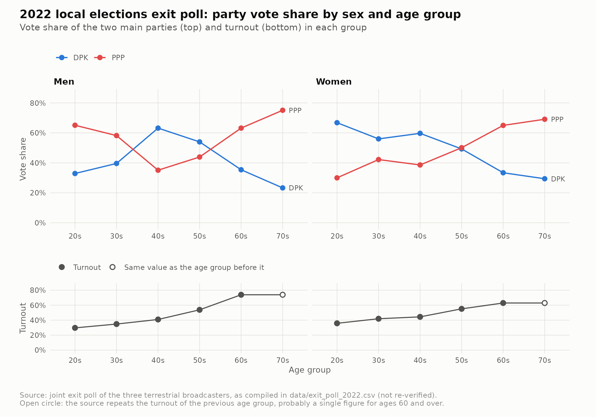
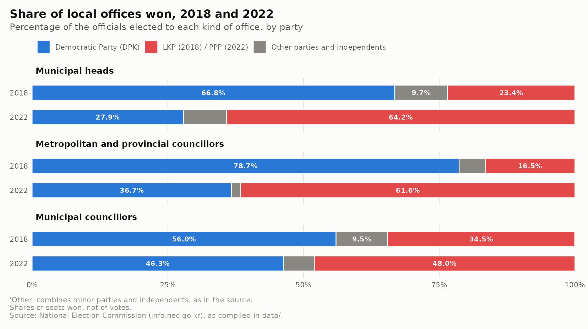

🇺🇸 [English](README.md) | 🇨🇳 [简体中文](README.zh-CN.md) | 🇭🇰 **繁體中文** | 🇯🇵 [日本語](README.ja.md) | 🇰🇷 [한국어](README.ko.md)

# korea-local-election-2022

以 R 在省級層面分析南韓第 8 屆地方選舉（2022 年 6 月），並與 2018 年地方選舉及 2022 年 3 月的總統選舉作比較。

[](https://github.com/jumincho/korea-local-election-2022/actions/workflows/ci.yml)
[](LICENSE)
[](https://www.r-project.org/)



## 概覽

2022 年 6 月 1 日，南韓舉行第 8 屆全國同步地方選舉，距離第 20 屆總統選舉不足三個月。本項目研究 17 個廣域自治團體（下文統稱「省級地區」：首爾、6 個廣域市、世宗及 9 個道）的選舉結果：

- 各廣域市長及道知事選舉由誰勝出、勝出幅度有多大；
- 各主要政黨的得票率與 2018 年第 7 屆地方選舉相比有何變化；
- 廣域市長及道知事選舉的得票與總統選舉的得票有多接近；
- 按性別及年齡組別劃分的票站調查得票率；
- 基礎自治團體長及地方議會當選人的政黨組成。

數據是附有說明文件的整潔（tidy）表格，並有測試確保它們與 2022 年的原始檔案相符。R 程式碼可重新產生本 README 中的每一幅圖及每一個數字。

## 主要發現

本節的每個數字均由 `make figures` 計算，並儲存於 [`results/key_statistics.csv`](results/key_statistics.csv)，CI 每次推送時都會檢查此檔案。無論人口多少，每個省級地區的權重都相同。

- **廣域市長及道知事選舉**：2018 年，在全部 17 場廣域市長及道知事選舉中，共同民主黨（DPK）贏得 14 場，自由韓國黨（LKP）贏得 2 場，獨立候選人贏得 1 場（濟州）。2022 年，國民力量（PPP）贏得 12 場，共同民主黨贏得 5 場。（[圖 1](#1-各省級地區的勝出政黨)）
- **2022 年的得票差距**：有兩場選舉的勝負差距少於 5 個百分點，分別是京畿道（共同民主黨領先 0.15 個百分點）及大田（國民力量領先 2.39 個百分點）。領先幅度最大的是共同民主黨在全羅北道的 64.23 個百分點，以及國民力量在大邱的 60.78 個百分點。（[圖 2](#2-2022-年的得票差距)）
- **2018 年以來的變化**：共同民主黨在廣域市長及道知事選舉的得票率，於 17 個省級地區中有 15 個下跌，按中位數計跌了 13.11 個百分點；跌幅最大的是世宗，達 24.14 個百分點。該黨在全羅北道及濟州的得票率則上升。主要保守政黨（2018 年為自由韓國黨，2022 年為國民力量）的得票率，在兩次選舉均有派出候選人的 15 個省級地區全部上升，其中升幅最小的是京畿道（13.40 個百分點），最大的是 2018 年由獨立候選人勝出的濟州（36.22 個百分點）。（[圖 3](#3-2018-年以來的變化)）
- **總統選舉與廣域市長及道知事選舉的得票率**：按省級地區比較，各黨在 2022 年 6 月廣域市長及道知事選舉的得票率，與其在 2022 年 3 月總統選舉的得票率非常接近。以 17 個省級地區計算，共同民主黨的皮爾遜相關係數 r = 0.97（95% 置信區間 0.93 至 0.99），國民力量則為 0.98（0.96 至 0.99）。以不加權平均計，共同民主黨的廣域市長及道知事候選人得票率比該黨的總統選舉得票率低 3.0 個百分點，國民力量的候選人則高 4.6 個百分點。（[圖 4](#4-總統選舉與廣域市長及道知事選舉的得票率)）
- **2018 年與 2022 年的廣域市長及道知事選舉得票率**：兩次地方選舉之間的得票率較不一致，共同民主黨為 r = 0.77（0.46 至 0.91，17 個省級地區），自由韓國黨/國民力量為 0.87（0.64 至 0.96，15 個省級地區）。（[圖 5](#5-2018-年與-2022-年的廣域市長及道知事選舉得票率)）
- **票站調查**：男女差異在 20 多歲的選民中最大，男性有 65.1% 投給國民力量、32.9% 投給共同民主黨，女性則有 66.8% 投給共同民主黨、30.0% 投給國民力量。在 12 個性別及年齡組別中，共同民主黨在 5 個組別領先，即 40 多歲及 50 多歲的男性，以及 20 多歲、30 多歲及 40 多歲的女性。投票率由 29.7%（20 多歲男性）至 73.9%（60 多歲及 70 多歲男性，兩者在原始數據中共用同一數字）不等。（[圖 6](#6-按性別及年齡劃分的票站調查)）
- **地方公職**：在基礎自治團體長之中，共同民主黨所佔比例由 2018 年的 66.81% 跌至 2022 年的 27.88%，自由韓國黨/國民力量則由 23.45% 升至 64.16%。在廣域議會中，共同民主黨所佔比例由 78.65% 跌至 36.72%，自由韓國黨/國民力量則由 16.53% 升至 61.57%。（[圖 7](#7-地方公職當選情況)）

## 圖表

所有圖表均由 [`scripts/make_figures.R`](scripts/make_figures.R) 輸出至 [`figures/`](figures)。

### 1. 各省級地區的勝出政黨

2018 年和 2022 年各廣域市長及道知事選舉的勝出政黨（即本頁頂部的地圖）。

### 2. 2022 年的得票差距

在 2022 年各場廣域市長及道知事選舉中，國民力量得票率減去共同民主黨得票率之差，以地圖及排序棒形圖呈現。



### 3. 2018 年以來的變化

各主要政黨在 2018 年和 2022 年的得票率，每個省級地區佔一行。



### 4. 總統選舉與廣域市長及道知事選舉的得票率

比較各省級地區在 2022 年 3 月總統選舉的得票率與在 2022 年 6 月廣域市長及道知事選舉的得票率，並附 y = x 直線、最小二乘法擬合線及皮爾遜 r。



### 5. 2018 年與 2022 年的廣域市長及道知事選舉得票率

以同樣方式比較 2018 年與 2022 年的廣域市長及道知事選舉。保守政黨的分圖把 2018 年的自由韓國黨與 2022 年的國民力量配對。



### 6. 按性別及年齡劃分的票站調查

2022 年票站調查中按性別及年齡組別劃分的兩大政黨得票率及投票率。



### 7. 地方公職當選情況

2018 年和 2022 年當選人的政黨組成：基礎自治團體長、廣域議會議員及基礎議會議員。



## 數據

| 數據表 | 內容 | 來源 |
|---|---|---|
| [`vote_share.csv`](data/vote_share.csv) | 各省級地區每名候選人所屬政黨的得票率：2018 年及 2022 年廣域市長及道知事選舉、2022 年總統選舉 | 中央選舉管理委員會（[info.nec.go.kr](http://info.nec.go.kr)） |
| [`elected_officials_share.csv`](data/elected_officials_share.csv) | 2018 年及 2022 年三類地方公職的當選人中各政黨所佔比例 | 中央選舉管理委員會 |
| [`exit_poll_2022.csv`](data/exit_poll_2022.csv) | 按性別及年齡組別劃分的兩大政黨得票率及投票率 | 各地面電視台的聯合票站調查，依 2022 年的紀錄（未經重新核實） |
| [`geo/provinces.geojson`](data/geo/provinces.geojson) | 經簡化的省級地區邊界 | 2022 年的省級地區 shapefile，在本項目中清理及簡化 |
| [`provinces.csv`](data/provinces.csv)、[`parties.csv`](data/parties.csv)、[`elections.csv`](data/elections.csv)、[`offices.csv`](data/offices.csv) | 對照表：代碼、英文及韓文名稱、標籤、顏色 | |

2022 年的原始檔案原封不動地保存在 [`data-raw/`](data-raw)，與把它們轉換成整潔數據表的腳本放在一起，另有測試檢查每個數值在轉換後均沒有改變。使用數據前須留意以下幾點：

- 部分次要候選人的數據缺失，因此少數選舉的得票率加起來不足 100。忠清南道 2022 年選舉的總和為 100.04，顯示可能有一個數值輸入錯誤；該數值按原始紀錄保留。
- 原始數據中，60 多歲及 70 多歲組別的票站調查投票率相同。
- 2018 年自由韓國黨在光州及全羅南道沒有派出候選人，而濟州 2018 年的選舉由獨立候選人勝出。
- 當選人數據是議席的比例，而非得票的比例。

[`data/README.md`](data/README.md) 載有完整的數據字典、來源說明及[注意事項](data/README.md#caveats)。

## 方法

- **表格之間以官方省級地區代碼連接**。所有數據表及邊界數據都使用兩位數的省級地區代碼（`CTPRVN_CD`），而 [`R/data.R`](R/data.R) 中的讀取函數會拒絕不明的代碼、政黨或選舉。沒有任何數據按行的次序配對。
- **定義**：勝出者是得票率最高的候選人。*得票差距*是國民力量得票率減去共同民主黨得票率，以百分點計。*變化*是某政黨 2022 年的得票率減去其 2018 年的得票率，並把自由韓國黨（2018 年）與國民力量（2022 年）視為同一保守政黨。某政黨沒有派出候選人時便沒有得票率，因此也沒有變化：不會當作零計算。
- **相關係數**是以省級地區為單位計算的皮爾遜 r，95% 置信區間由 `cor.test()` 求得，最小二乘法擬合線則由 `lm()` 求得。無論人口多少，每個省級地區只計一次。由於只有 17 個點（保守政黨 2018 年與 2022 年的比較只有 15 個），置信區間較寬。相關係數反映的是選票的地理分佈，而非個人如何投票。
- **邊界**：原始數據中相鄰省級地區的邊界並不吻合。這些邊界先清理成規範的覆蓋（coverage），再以 200 m 的容差逐條簡化共用邊界，因此相鄰地區仍然準確接合。經此處理，檔案由 13 MB 縮小至 564 KiB，而任何省級地區的面積變化都不超過 0.4%。詳見 [`data/README.md`](data/README.md#boundaries)。
- **圖表**以 ggplot2 繪製並採用英文標籤，因此無需 CJK 字型。共同民主黨的藍色與自由韓國黨/國民力量的紅色在模擬紅色盲及綠色盲的情況下仍可區分；其他政黨以中性灰色顯示，而且顏色一定配有圖例或直接標籤。

## 項目結構

```
.
├── R/                         函數，由腳本及測試以 source 載入
│   ├── data.R                 讀取及驗證整潔數據
│   ├── analysis.R             勝出者、得票差距、變化、相關係數
│   ├── summary.R              本 README 引用的主要統計數字
│   ├── theme.R                顏色、ggplot2 主題、PNG 輸出
│   └── plots.R                每幅圖一個函數
├── data/                      整潔數據；見 data/README.md
│   └── geo/provinces.geojson  經簡化的邊界
├── data-raw/                  原始輸入及建立 data/ 的腳本
│   ├── original/              2022 年的 CSV 檔案，未經改動
│   └── shapefile/             省級地區邊界檔案，未經改動
├── scripts/make_figures.R     重新產生 figures/ 及 results/
├── figures/                   上述圖表（PNG，200 dpi）
├── results/key_statistics.csv 上文引用的數字
├── tests/                     testthat 測試套件；由 tests/testthat.R 執行
├── docs/presentation.pptx     簡報投影片
├── DESCRIPTION                R 依賴套件
├── Makefile                   make data | figures | test | lint
└── .github/workflows/ci.yml   每次推送時執行 lint、測試及重建
```

## 重現方法

你需要 R 4.1 或以上版本，以及 [`DESCRIPTION`](DESCRIPTION) 所列的套件。在 CI 所用的 Ubuntu 24.04 上，這些套件全部可從 Ubuntu 軟件庫安裝：

```sh
sudo apt-get install -y --no-install-recommends \
  r-base-core r-cran-sf r-cran-ggplot2 r-cran-dplyr r-cran-tidyr r-cran-readr \
  r-cran-patchwork r-cran-ggrepel r-cran-scales r-cran-testthat r-cran-lintr \
  r-cran-ragg r-cran-here
```

在其他系統上，請從 CRAN 安裝（sf 需要 GDAL、GEOS 及 PROJ；CRAN 的 macOS 及 Windows 二進制版本已包含這些程式庫）：

```sh
Rscript -e 'install.packages("remotes"); remotes::install_deps(dependencies = TRUE)'
```

然後在儲存庫的根目錄執行：

```sh
make figures   # figures/*.png 及 results/key_statistics.csv
make test      # 測試套件
make lint      # lintr，採用 .lintr 的設定
make data      # 由 data-raw/ 的原始檔案重建 data/
```

如不使用 `make`，可執行 `Rscript scripts/make_figures.R` 及 `Rscript tests/testthat.R`。

## 授權條款

[MIT](LICENSE)，© 2022 jumincho。
